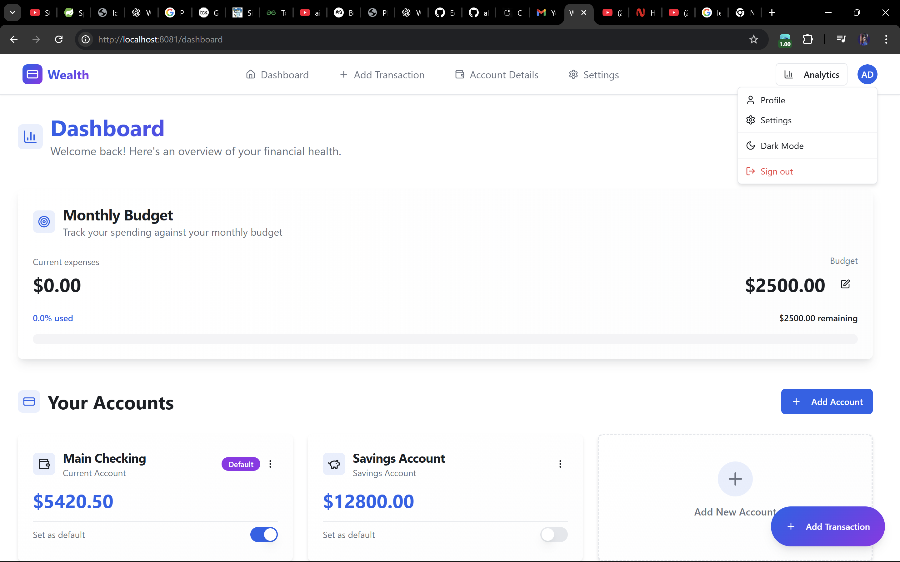
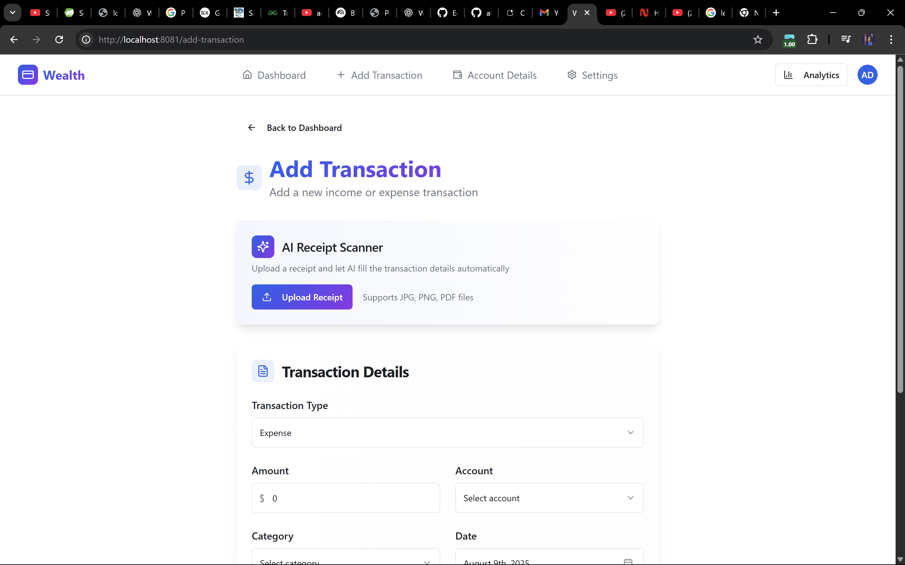
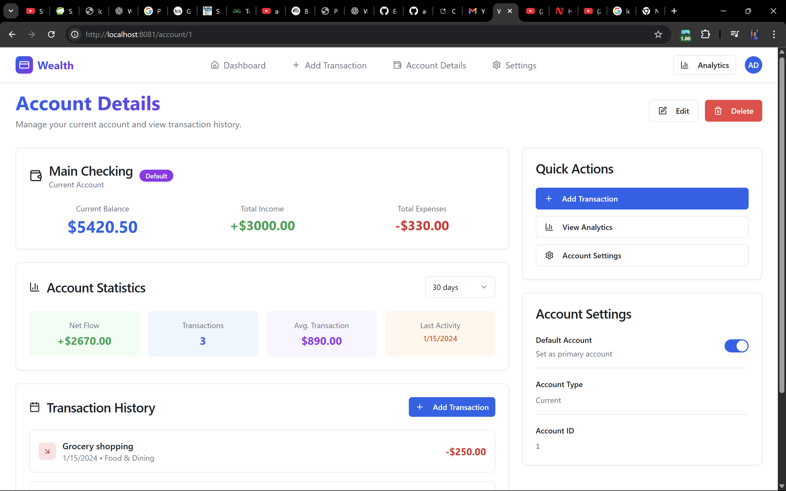
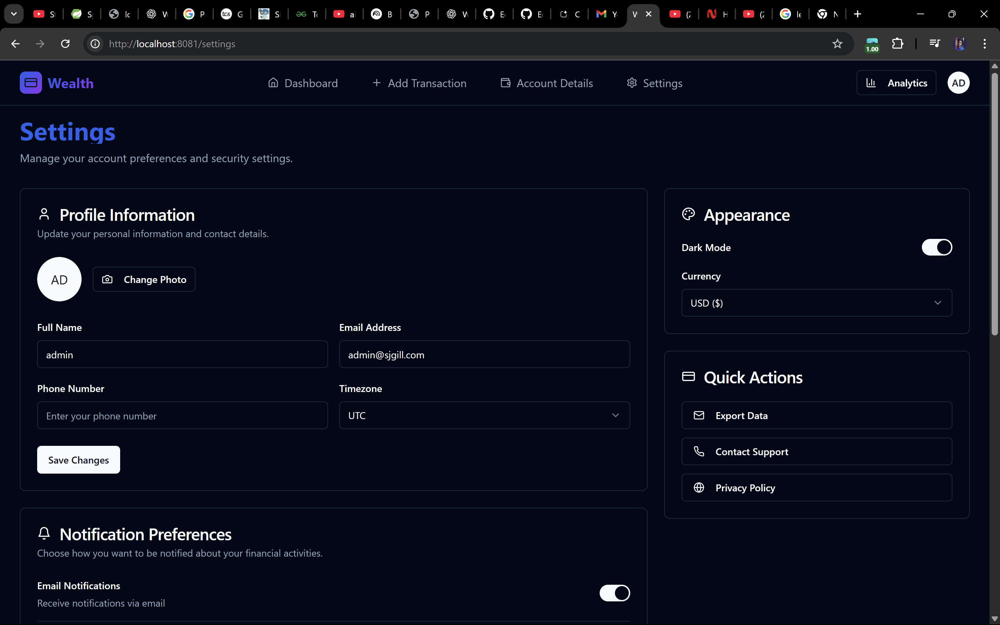

# 💰 Wealth - AI Powered Finance Platform

**Wealth** is a modern, AI-powered personal finance management platform that helps users take control of their money by intelligently tracking income, managing expenses, planning budgets, and gaining deep financial insights – all wrapped in a clean, responsive, and user-friendly interface.

---

## 🧠 Key AI-Powered Features

### 🧾 Smart Receipt Scanner
> Simply upload a receipt and let AI do the rest.

- Automatically extracts **amount**, **date**, **description**, and **store name/category** from any receipt image.
- Uses **Gemini AI** for precise extraction.
- Auto-fills the transaction form to save time and reduce manual entry.

### 📊 Monthly AI Financial Reports & Insights
> Personalized financial advice – in your inbox, every month.

- Automatically generates **financial reports** every month.
- AI provides **3 smart, actionable insights** based on your income and spending patterns.
- Suggestions include expense-saving tips, category analysis, and good financial habits.

### 🚨 Real-Time Budget Alerts
> Stay in control, always.

- Sends **email alerts** when you're nearing (80%) your monthly budget.
- Helps you cut down unnecessary expenses before it's too late.

---

## 📸 Screenshots

<table>
  <tr>
    <td align="center">
       
      <b>Dashboard with charts</b>
    </td>
    <td align="center">
       
      <b>Smart receipt scanner</b>
    </td>
  </tr>
  <tr>
    <td align="center">
       
      <b>Monthly report preview</b>
    </td>
    <td align="center">
       
      <b>Dark mode preview</b>
    </td>
  </tr>
</table>

---
## 🧩 Core Features

- 📈 **Dashboard Overview** – Summary of income, expenses, budget progress, and accounts.
- 🔄 **Add/Edit Transactions** – Categorize your income and expenses.
- 🏦 **Multiple Accounts** – Manage multiple financial accounts with ease.
- 📉 **Visual Charts** – Interactive pie and bar charts for expense breakdown and trends.
- 🔎 **Transaction Table** – Sortable, searchable, and filterable list of all your transactions.
- ✨ **AI Receipt Scanner** – Upload receipts and let AI auto-fill transaction details.
- 📬 **Email Reports & Alerts** – Automated reports and budget warnings.
- 🌗 **Dark/Light Mode** – Toggle between dark and light themes.
- 📱 **Responsive Design** – Fully optimized for desktop, tablet, and mobile.

---

## 🛠️ Tech Stack

### 🔹 Frontend
- **React** (with Vite)
- **Tailwind CSS**
- **Shadcn UI** (modern component system)
- **Recharts** for data visualization
- **React Router** for SPA navigation
- **Dark/Light Theme Support**

### 🔹 Backend
- **Spring Boot** (Java)
- **MongoDB** (NoSQL)
- **Gemini AI API** (Google AI integration)
- **Email Scheduler with Cron Jobs** (`@Scheduled`)
  - Monthly reports (1st of each month)
  - Budget alerts (every 6 hours)

---

## 🔐 Authentication & Security

- Secure **JWT-based authentication**.
- **Google OAuth** login support.
- Protected routes for Dashboard, Add Transaction, Account Details, etc.

---

## 📦 Folder Structure

├── frontend/  
│ ├── public/ 
│ ├── src/ 
│ │ ├── components/ 
│ │ ├── pages/ 
│ │ ├── assets/ 
│ │ ├── utils/ 
│ │ └── App.jsx 
├── backend/ 
│ ├── src/ 
│ │ ├── main/ 
│ │ │ ├── java/ 
│ │ │ ├── resources/ 
│ └── pom.xml 

---

## 📅 Future Improvements

- 📱 Mobile App (React Native)
- 🔔 Push Notifications
- 🧾 OCR tuning for multilingual receipts
- 🧠 AI spending predictions (coming soon)

## 👨‍💻 Contributing

We welcome contributions!

# Fork the repository
# Clone your fork
git clone https://github.com/your-username/wealth-ai-finance.git

# Create a new branch
git checkout -b feature/your-feature-name

# Make changes, then push
git add .
git commit -m "Add your message"
git push origin feature/your-feature-name

